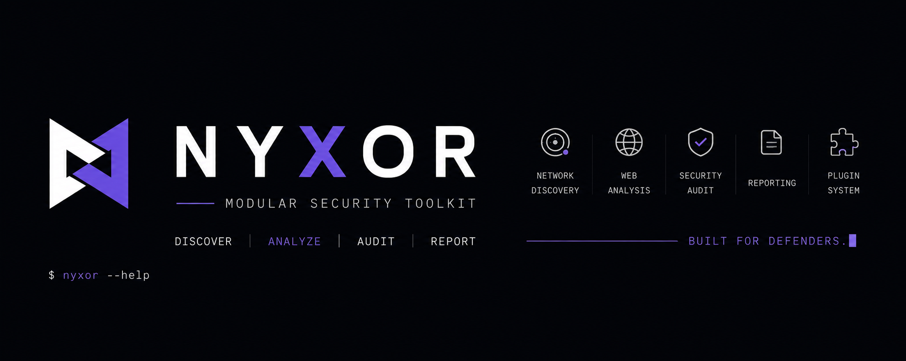

<div align="center">



[](https://github.com/ivnovomi/nyxor/actions/workflows/ci.yml)
[](https://www.python.org/)
[](https://docs.astral.sh/uv/)
[](LICENSE)

**Discover. Analyze. Audit. Report.** — a security toolkit with its own
scripting language, a full-screen terminal dashboard, a local-AI copilot,
an MCP server, and a language server your editor can talk to.

</div>

---

## TL;DR

For people who scroll instead of read:

- `uv sync --extra dev && uv run nyx audit example.com` → a live DNS/TLS/HTTP
  assessment, a letter grade, a pill badge printed straight in your terminal.
  One command, zero config.
- **Everything is one engine, six front-ends.** The exact same `async def
  run_*()` coroutine backs the CLI, the TUI dashboard, the REST API,
  NyxScript's `run` statement, and the MCP server. Nothing is ever
  reimplemented twice — fix a bug once, it's fixed everywhere.
- **NyxScript** is a real language living inside NYXOR — lexer, parser, AST,
  interpreter, static linter, dicts, `try`/`except`, a standard library
  written in itself, and now an interactive REPL (`nyx script repl`).
- **Local AI, not cloud AI.** `nyx analyze`, `nyx ask`, `nyx audit --dumber`,
  `nyx audit --fix-suggestions`, and `nyx watch --narrate` all talk to a
  local [Ollama](https://ollama.com) model on your own machine — your own
  GPU if Ollama's using one, nothing shipped off to anyone, ever. No model
  running? Every one of those falls back gracefully instead of breaking.
- **Passive only, always.** DNS lookups, TLS handshakes, HTTP requests,
  certificate-transparency logs, response-header fingerprinting. No
  exploitation, no packet crafting, no raw sockets, nothing that needs root.
- **Ask Claude to use it.** `nyx mcp` exposes the whole toolkit as an MCP
  server, and there's a bundled Claude Skill that teaches Claude the
  NyxScript language, so an AI agent can write and run `.nyx` automation
  correctly on the first try.
- 24 commands, actually organized: `nyx --help` groups everything into
  named panels (Scanning, AI, Automation, ...) instead of one giant
  alphabet-soup list.

Not convinced yet? Keep scrolling — there's a Matrix-rain easter egg
(`nyx matrix`) that does absolutely nothing useful and we kept it anyway.

---

NYXOR is a modular, cross-platform security **assessment and infrastructure
auditing** toolkit. It is *not* a hacking framework — everything it does is a
safe, non-destructive observation: TCP-connect checks, standard DNS lookups,
TLS handshakes, HTTP requests, public certificate-transparency logs. No
exploitation, no packet crafting, no raw sockets, nothing that needs elevated
privileges. Point it at something you're authorized to check, and it tells
you exactly what it found.

What makes it more than a wrapper around a few scanners:

- **A real automation language.** [NyxScript](#nyxscript) isn't a config
  format bolted onto a scanner — it has its own lexer, parser, AST,
  tree-walking interpreter, a *static linter* that catches your typos before
  you burn a network round-trip on them, dicts, `try`/`except` error
  handling, a standard library written in itself, and an interactive REPL.
  It even has a [Language Server](#editor-support), a VS Code extension, and
  a [Claude Skill](.claude/skills/nyxscript/).
- **Local AI that's actually local.** [`nyx analyze` / `nyx ask` /
  `--dumber` / `--fix-suggestions` / `--narrate`](#local-ai) all talk to a
  model running on your own hardware via Ollama — no API key, no per-token
  bill, nothing leaves the machine. Every one degrades gracefully to a
  deterministic fallback if no model is running.
- **A dashboard, not just a CLI.** `nyx tui` is a full Textual application —
  live scans, a syntax-highlighted script editor with autocomplete, a
  plugin browser you can edit in place — built on the *exact same functions*
  the CLI calls. Nothing is reimplemented twice.
- **Claude can drive it directly.** [`nyx mcp`](#mcp-server--claude) exposes
  the audit modules and NyxScript as MCP tools, so an agent can run an
  `audit`/`recon`/`hostcheck` and reason about the results without shelling
  out.
- **A grade, not just a wall of JSON.** `nyx audit` scores what it finds
  (0–100, SSL-Labs style), hands you a letter grade plus a terminal pill
  badge and an embeddable SVG, and passively fingerprints the tech
  stack/CDN/WAF behind it — all from data already fetched, zero extra
  requests. `nyx watch` reruns it on a schedule and only speaks up when the
  grade — or the findings behind it — actually change.
- **Everything is a plugin.** The Core is deliberately tiny: CLI wiring,
  config, logging, the plugin loader, the reporting framework. Every
  capability — including the ones that ship in the box — is discovered
  through the same entry-point mechanism a third-party package would use.

```
nyx doctor              # environment diagnostics
nyx tui                 # interactive dashboard (overview, inventory, live scans, script editor, plugin browser)
nyx audit <domain>      # combined DNS + TLS + HTTP assessment, letter grade, tech-stack fingerprint
nyx watch <domain>      # keep auditing on an interval, report only what changes (--narrate for AI commentary)
nyx recon <domain>      # passive subdomain discovery via certificate transparency
nyx hostcheck           # local host hygiene — masquerading processes, suspicious autorun
nyx network discover    # host discovery (ping / CIDR sweep)
nyx network scan        # TCP service enumeration + passive banner grabbing
nyx dns lookup          # DNS records, DNSSEC, mail posture
nyx tls inspect         # certificate + protocol/cipher inspection
nyx http inspect        # headers, redirects, cookies, security headers, fingerprint
nyx analyze <domain>    # AI-written findings summary (local model, rule-based fallback)
nyx ask ["question"]    # chat with the local model about your scan history
nyx inventory list      # discovered assets
nyx script run/lint/new/repl  # NyxScript automation (see below)
nyx mcp                 # expose NYXOR to Claude and other MCP clients
nyx report convert      # JSON -> Markdown/HTML
nyx serve               # REST API — same scans, over HTTP (see below)
nyx matrix              # a screensaver. not a security feature. we know.
nyx plugin list         # installed plugins
nyx config show         # effective configuration
```

Run `nyx` with no arguments for the banner + command list, or `nyx --help`
for the same list grouped into named panels.

## Quickstart

```bash
uv sync --extra dev
uv run nyx audit example.com
```

That's a live DNS + TLS + HTTP assessment with a letter grade and a
passive tech-stack fingerprint, in one command, with zero configuration.

Want the plain-English version, or a local model's take?

```bash
uv run nyx audit example.com --dumber           # no-jargon explanation of every finding
uv run nyx audit example.com --fix-suggestions  # concrete remediation steps
uv run nyx analyze example.com                  # a short written summary
```

Any of these will use a local [Ollama](https://ollama.com) model if one's
running (`ollama pull llama3.2`), and fall back to a templated/rule-based
version automatically if not. Nothing ever breaks because a model isn't
installed.

## Table of contents

- [Security grade & badges](#security-grade--badges)
- [Local AI](#local-ai)
- [Passive fingerprinting](#passive-fingerprinting)
- [Host hygiene — `nyx hostcheck`](#host-hygiene--nyx-hostcheck)
- [Passive recon — `nyx recon`](#passive-recon--nyx-recon)
- [MCP server & Claude](#mcp-server--claude)
- [The REST API](#the-rest-api)
- [The dashboard](#the-dashboard)
- [NyxScript](#nyxscript)
  - [Dicts and error handling](#dicts-and-error-handling)
  - [The standard library](#the-standard-library)
  - [The REPL](#the-repl)
  - [Escape hatches: `python:` and `pip`](#escape-hatches-python-and-pip)
  - [Editor support](#editor-support)
- [Requirements & install](#requirements)
- [Global options](#global-options)
- [Configuration](#configuration)
- [Architecture](#architecture)
- [Testing](#testing)
- [Contributing](#contributing)

## Security grade & badges

`nyx audit` scores every run on a 0–100 scale (SSL-Labs-style: findings
subtract points by severity), maps it to a letter grade, and prints a
shields.io-style pill badge straight in your terminal using Rich truecolor
backgrounds — no image viewer required. Want it in a README or status page
instead?

```bash
nyx audit example.com --badge badge.svg
```

writes a shields.io-style flat SVG badge (`nyxor: example.com | A`) you can
embed anywhere. `nyx watch` uses the same grade to flag regressions:

```bash
nyx watch example.com --interval 300 --narrate
```

reruns the audit every 5 minutes and stays quiet — a heartbeat line —
until something actually changes: a new finding, a resolved one, or a
grade transition, each timestamped and color-coded. `--narrate` asks a
local model for a one-line plain-English take on the change, if one's
running.

## Local AI

Every AI feature in NYXOR talks to the same local
[Ollama](https://ollama.com) server `nyx analyze` has used since it
shipped — your own GPU if Ollama's configured to use one, no API key, no
per-token cost, nothing sent anywhere unless you explicitly point `--host`
at something else yourself. None of these need AI to work; they all
degrade to a deterministic fallback if no model answers.

| Command | What it does |
|---|---|
| `nyx analyze <domain>` | Audits a domain, gets a short written summary from the model (rule-based fallback) |
| `nyx audit --dumber` | Finding-by-finding, no-jargon explanation (templated fallback) |
| `nyx audit --fix-suggestions` | Concrete remediation steps for medium+ findings |
| `nyx watch --narrate` | A one-line plain-English take on what changed |
| `nyx ask ["question"]` | Chat about your recorded `nyx audit`/`nyx trends` history — single-shot or an interactive REPL |

```bash
ollama pull llama3.2       # once
nyx ask "which of my domains got worse this month?"
```

## Passive fingerprinting

`nyx http inspect` (and therefore `nyx audit`) passively identifies the
tech stack, CDN, and WAF behind a target — from data already fetched for
the request (response headers, cookie names, page markup, including
`<meta name="generator">`). Zero extra requests, zero active probing,
signature matching only:

```
│ info   │ Detected technology │ WordPress, WordPress 6.4.2, nginx │
│ info   │ CDN / WAF            │ Cloudflare                       │
```

## Host hygiene — `nyx hostcheck`

Not an antivirus — no signature database, no real-time protection, no
kernel hooks. Two honest, explainable local checks: a process claiming to
be a well-known Windows system binary but running from the wrong place
(masquerading), and a process running out of a temp/downloads-style
directory. Optionally cross-checked against VirusTotal's free hash-lookup
API if you supply your own key.

```bash
nyx hostcheck --vt-api-key $VT_API_KEY
nyx hostcheck --kill   # offers to terminate HIGH-severity findings, one at a time, with confirmation
```

## Passive recon — `nyx recon`

Subdomain discovery via certificate-transparency logs (crt.sh) — reads a
public, third-party log of certificates already issued for a domain.
Never touches the target directly.

```bash
nyx recon example.com
```

## MCP server & Claude

```bash
uv sync --extra mcp
nyx mcp   # stdio MCP server — point Claude Desktop / Claude Code at it
```

Exposes `audit`, `dns_lookup`, `tls_inspect`, `http_inspect`, `recon`,
`hostcheck`, `lint_nyxscript`, and `run_nyxscript` as MCP tools, all
wrapping the exact same `run_*()` coroutines the CLI/TUI/REST API use.
Deliberately narrower than the CLI: no `hostcheck --kill` and no
`--unsafe` NyxScript execution are reachable through it, since an MCP
tool can be invoked autonomously with no human confirming each call.

There's also a bundled [Claude Skill](.claude/skills/nyxscript/) that
teaches Claude the NyxScript grammar, so an agent writing `.nyx`
automation gets it right without re-deriving the language from scratch.

## The REST API

Same modules, another front-end: `nyx serve` runs a small FastAPI app over
the identical `run_*` coroutines the CLI/TUI/NyxScript/MCP use — no scan
logic is reimplemented for HTTP.

```bash
uv sync --extra api
nyx serve --port 8842   # interactive docs at http://127.0.0.1:8842/docs
```

```bash
curl http://127.0.0.1:8842/audit/example.com/score
# {"domain":"example.com","grade":"A","points":94,"finding_counts":{"info":16,"low":0,"medium":1,"high":0,"critical":0}}
```

The fun one — a *live-generated* security badge, re-audited on every
request, straight from a URL:

```markdown

```

Other endpoints: `GET /health`, `GET /plugins`, `GET /audit/{domain}`,
`GET /dns/{domain}`, `GET /tls/{target}`, `GET /http?url=...`,
`GET /inventory`. All return the same `ModuleResult`/`Finding` JSON shapes
the CLI's `--json` does, because they're the same Pydantic models.

## The dashboard

`nyx tui` launches a full-screen [Textual](https://textual.textualize.io/)
dashboard on top of the exact same plugin logic the CLI uses — nothing is
reimplemented, every tab just calls the same `run_*` coroutines as the CLI:

- **Overview** — live environment diagnostics (the same checks as `nyx
  doctor`) plus at-a-glance stat cards (plugins loaded, findings, inventory
  size).
- **Inventory** — every discovered asset in a sortable table, with one-click
  refresh, HTML export, and clear.
- **Scan** — pick a module (full audit, network discover/scan, DNS lookup,
  TLS inspect, HTTP inspect, recon), enter a target, and watch findings
  stream in, color-coded by severity — new assets land in the inventory
  automatically.
- **Script** — a syntax-highlighted editor for [NyxScript](#nyxscript)
  files: keywords, module names, strings, numbers, dicts, and comments are
  colored as you type, with real auto-indent and a floating completion
  box. Open, edit, save, lint, and run `.nyx` scripts without leaving the
  dashboard, with a live output log. Running a script with lint errors is
  refused until you fix them. An **Unsafe** switch (off by default) is
  required before `python:` blocks or `pip` statements are allowed to
  actually run.
- **Plugins** — browse every installed plugin, view and lightly edit its
  `plugin.py` source in place, or scaffold a brand-new plugin skeleton
  under `./nyxor_plugins/<name>/` from a name you type in.
- **About** — version and plugin summary.

Keys: `1`–`5` switch tabs, `r` refreshes, `q` quits.

## NyxScript

NyxScript is a small, intentionally safe language for batch-driving NYXOR
modules — no `eval`, no arbitrary code execution. It has a real lexer,
recursive-descent parser, AST, tree-walking interpreter, and a standalone
static linter, with a grammar that covers variables, functions, `if`/
`else`, `foreach`/`while` loops, `try`/`except` error handling, lists and
dicts, string interpolation, and imports.

```
import "lib/validate.nyx" as validate

set targets = ["example.com", "example.org"]
set results = {}

foreach target in targets:
    if not validate.is_valid_domain(target):
        print "skipping {target}: doesn't look like a domain"
        continue
    end

    print "Auditing {target}..."
    try:
        run audit target as result
        set results[target] = len(result)
    except err:
        print "  {target} failed: {err}"
    end
end

print "Done. {len(keys(results))} domain(s) audited."
```

```bash
nyx script new my-audit.nyx    # scaffold a starter script
nyx script lint my-audit.nyx   # static-check it — no network access
nyx script run my-audit.nyx    # lints, then executes (--no-lint to skip)
nyx script repl                # interactive prompt — variables persist across lines
```

The linter catches undefined variables (including inside `"{...}"`
interpolation, across `if`/`foreach`/`try`/`except` branches), unknown
`run` modules (with a "did you mean" suggestion), and empty control-flow
bodies — all without touching the network. `nyx script run` refuses to
execute a script with lint errors unless you pass `--no-lint`.

### Dicts and error handling

```
set d = {"host": "example.com", "port": 443}
set d["port"] = 8443              # in-place mutation, chainable
print get(d, "missing", "n/a")    # dict.get() with a mandatory default — no null to fall back to

try:
    set n = int(user_input)
except err:
    print "not a number: {err}"
end
```

### The standard library

Shipped `lib/` — written entirely in NyxScript itself, imported like any
other file:

| File | Functions |
|---|---|
| `math.nyx` | `mod`, `clamp`, `mean`, `median`, `gcd`, `is_prime` |
| `dict.nyx` | `merge`, `pick`, `invert`, `from_pairs` |
| `validate.nyx` | `is_valid_port`, `is_valid_ipv4`, `is_valid_domain` |
| `collection.nyx` | `unique`, `chunk` |
| `strings.nyx` | `title_case`, `truncate` |
| `finding.nyx` / `report.nyx` | severity breakdowns and summary printing over scan results |

### The REPL

```
$ nyx script repl
nyx> set d = {}
nyx> set d["found"] = 0
nyx> func bump():
...     set d["found"] = d["found"] + 1
... end
nyx> bump()
nyx> print d
{found: 1}
```

Variables and functions persist across lines; multi-line blocks
(`if`/`foreach`/`while`/`func`/`try`/`python:`) are detected and only run
once their matching `end` arrives.

### Escape hatches: `python:` and `pip`

For the rare case NyxScript's grammar isn't enough, two statements exist
but are **disabled unless you opt in** (`--unsafe` on the CLI, the Unsafe
switch in the TUI) — and are never reachable through the MCP server at all:

```
pip "cowsay"
python:
    import cowsay
    cowsay.cow(f"hello from {target}")
end
```

`python:` blocks run as real Python with direct read/write access to the
script's variables; `pip` installs a package into the current environment
(via `uv pip install` when available). Both require `--unsafe` precisely
because they step outside NyxScript's "just makes requests to the targets
you name" safety model — treat a script using them like you would any
other executable.

### Editor support

NyxScript has a real [Language Server](src/nyxor/lsp/server.py) (built on
[pygls](https://github.com/openlawlibrary/pygls)) that any LSP-capable
editor can use for live diagnostics, completion, and hover docs:

```bash
uv sync --extra lsp
nyx script lsp   # run by your editor, not by hand — speaks LSP over stdio
```

- **VS Code**: install the extension in
  [editors/vscode-nyxscript](editors/vscode-nyxscript) (syntax highlighting
  for the full grammar including dicts/`try`/`except`, the language server,
  `python:` blocks highlighted as embedded Python, its own file icon).
- **Neovim** (0.10+, built-in LSP client):
  ```lua
  vim.filetype.add({ extension = { nyx = "nyxscript" } })
  vim.api.nvim_create_autocmd("FileType", {
    pattern = "nyxscript",
    callback = function(args)
      vim.lsp.start({
        name = "nyxscript",
        cmd = { "nyx", "script", "lsp" },
        root_dir = vim.fs.dirname(vim.fs.find({ "nyxor.toml", ".git" }, { upward = true })[1]),
      }, { bufnr = args.buf })
    end,
  })
  ```
- **Anything else** with a generic LSP client: point it at `nyx script lsp`
  over stdio for `.nyx` files.
- **Claude / an MCP client**: the [nyxscript Claude Skill](.claude/skills/nyxscript/)
  teaches the language directly; `nyx mcp`'s `lint_nyxscript`/`run_nyxscript`
  tools let an agent check and run scripts without shelling out.

Available modules for `run`: `audit`, `dns`, `tls`, `http`,
`network.discover`, `network.scan`, `recon`. See
[docs/nyxscript.md](docs/nyxscript.md) for the full language reference and
grammar, or [core/scripting/](src/nyxor/core/scripting/) for the
implementation.

## Requirements

- Python 3.13+
- [`uv`](https://docs.astral.sh/uv/) for dependency management
- Optional: [Ollama](https://ollama.com) for local AI features (`nyx
  analyze`/`ask`/`--dumber`/`--fix-suggestions`/`--narrate`) — everything
  else needs nothing beyond the base install.

## Install (development)

```bash
uv sync --extra dev
uv run nyx --help
```

Other optional extras: `--extra lsp` (language server), `--extra api`
(REST API), `--extra mcp` (MCP server). This installs an editable
checkout, so `nyx` / `nyxor` on your `uv run` PATH reflect local source
changes immediately.

## Global options

Every command accepts:

| Flag | Purpose |
|---|---|
| `--verbose` / `-v` | Debug-level structured logging |
| `--json` | Emit machine-readable JSON to stdout |
| `--yaml` | Emit YAML to stdout |
| `--output PATH` / `-o` | Write a report to a file (format inferred from extension: `.json`, `.md`, `.html`) |
| `--profile NAME` / `-p` | Apply a named configuration profile |

## Configuration

NYXOR merges configuration from, lowest to highest precedence:

1. Packaged defaults
2. User config — `~/.config/nyxor/config.toml` (platform-appropriate path)
3. Project config — `./nyxor.toml`
4. The active `--profile`
5. `NYXOR_*` environment variables (`NYXOR_GENERAL__LOG_LEVEL=DEBUG`)
6. Explicit CLI flags

Run `nyx config init` to write a starter file, `nyx config show` to see the
fully resolved configuration, and `nyx config path` to see where NYXOR is
looking. Local-AI settings (`ai.ollama_host`, `ai.model`) live in there too.

## Architecture

See [docs/architecture.md](docs/architecture.md) for how the Core, plugin
system, and reporting framework fit together, and
[docs/plugin-development.md](docs/plugin-development.md) to add your own
module without touching the Core.

## Testing

```bash
uv run pytest
uv run ruff check .
uv run mypy src
```

CI runs the same checks — plus the full pytest suite on Linux, Windows, and
macOS, and a VS Code extension compile check — on every push and PR. See
the badge at the top of this file.

## Contributing

See [docs/contributing.md](docs/contributing.md).
